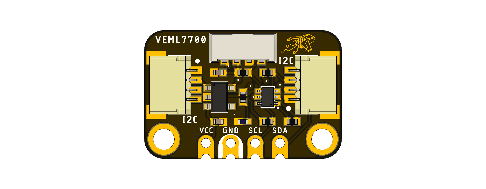

# Devlab: I2C VEML7700 Light Sensor

The DevLab I2C VEML7700 Light Sensor is a compact ambient light sensing module designed for rapid integration into embedded systems, educational platforms, and IoT applications. The board integrates the VEML7700 high-sensitivity ambient light sensor and communicates through the I²C protocol using the standardized DevLab connector ecosystem compatible with Qwiic and STEMMA QT.

The module supports ambient light measurements, white light sensing, and calibrated lux calculations with configurable gain and integration timing parameters. Its compact form factor and dual JST-SH connectors allow easy daisy-chain integration with other DevLab compatible modules.

  
  
<em>Development Board</em>

### Quick Setup

## Overview

| Feature                     | Description |
|-----------------------------|-------------|
| Sensor                      | VEML7700 Ambient Light Sensor |
| Communication Interface     | I²C |
| Default I²C Address         | `0x10` |
| Connector Type              | JST-SH 1.0 mm |
| Ecosystem Compatibility     | Qwiic / STEMMA QT / DevLab |
| Supported Measurements      | Ambient Light, White Light, Lux |
| Configurable Gain           | Supported |
| Configurable Integration Time | Supported |
| Operating Voltage           | 3.3V |
| Form Factor                 | DevLab Compact Module |

## Applications

## Resources

- [Schematic Diagram](#)
- [Pinout Diagram](#)
- [Getting Started Guide](#)

## 📝 License

All hardware and documentation in this project are licensed under the **MIT License**.  
See [`LICENSE.md`](LICENSE.md) for details.

  Template created by UNIT Electronics

